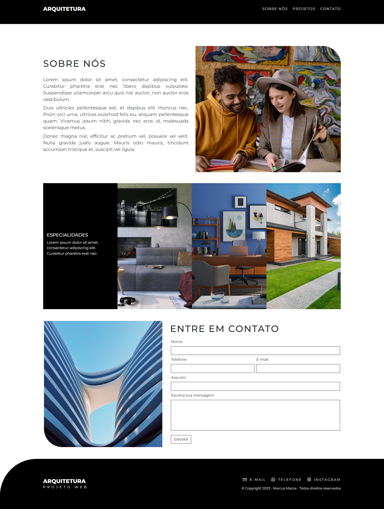

## Tópicos

 • <a href="#-sobre-o-projeto">Sobre o Projeto</a>  
 • <a href="#-tecnologias">Tecnologias</a>  
 • <a href="#-layout">Layout</a>  
 • <a href="#-autor">Autor</a>  

## Sobre o projeto

Arquitetura é um layout criado para o segmento de arquiteura e urbanismo
visando criar uma presença na internet de maneira elegante e coerente com 
o mercado de arquitetura.

## Tecnologias

#### **Website** ( [Bootstrap](https://getbootstrap.com/) + [jQuery](https://jquery.com/) + [PHP](https://www.php.net/) )

- [Glightbox](https://biati-digital.github.io/glightbox/)
- [Jquery Mask](https://igorescobar.github.io/jQuery-Mask-Plugin/)
- [Owl Carousel](https://owlcarousel2.github.io/OwlCarousel2/)
- [Php Mailer](https://github.com/PHPMailer/PHPMailer)

#### **Utilitários**

- Editor: **[Visual Studio Code](https://code.visualstudio.com/)**
- Fontes: **[Montserrat](https://fonts.google.com/specimen/Montserrat?query=montserrat)**
- Icones: **[Font Awesome](https://fontawesome.com/)**

## Layout

Veja o layout da aplicação:

Pagina Inicial:

  

Página Projetos:

  

Página Sobre Nós:

  

# Entre em contato

**Linkedin**: https://www.linkedin.com/in/marcus-mazza-5a6497190/

Desenvolvido por **Marcus Mazza**
